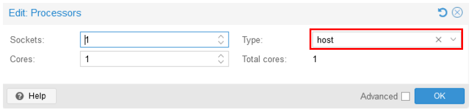
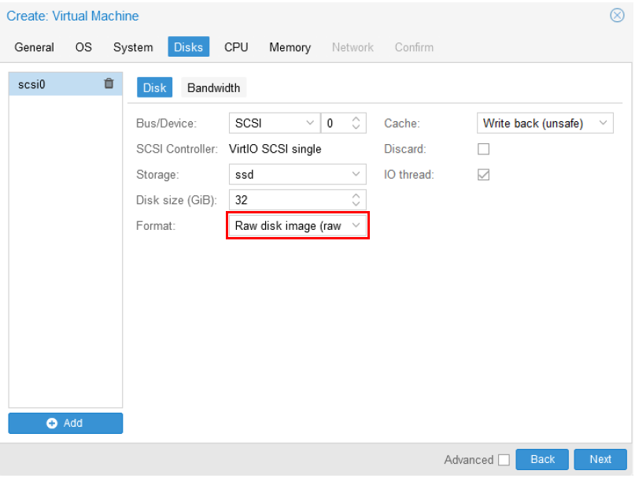
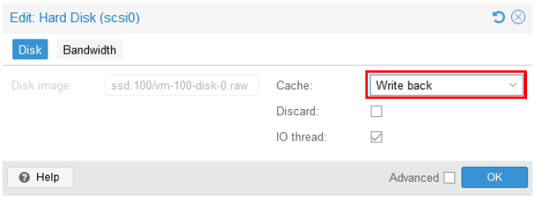
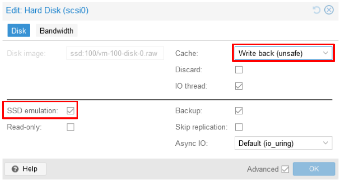

# Proxmox VE TIPS
Here are some tips for creating VMs on a Proxmox VE.
For more information on performance tweaks, please refer [here](https://pve.proxmox.com/wiki/Performance_Tweaks).

---

### [Sample Configurations and Miscellaneous for Mobile Network](https://github.com/s5uishida/sample_config_misc_for_mobile_network)

---

<a id="toc"></a>

## Table of Contents

- [Troubleshooting](#trouble)
  - [When starting MongoDB, an illegal instruction occurs and MongoDB crashes](#mongodb_crash)
  - [While building srsRAN_Project, an error occurs due to missing F16C, FMA and BMI instructions](#srsran_build_crash)
  - [An error occurs on VM in related to Secure Boot](#error_related_to_secure_boot)
- [Performance Improvement](#perf_imp)
  - [Filesystem mount option](#mount_opt)
  - [Selecting the format type of disk when creating a VM](#select_disk_format_type)
  - [Selecting the cache type of disk](#select_disk_cache_type)
  - [VirtIO paravirtualized NIC](#virtio_nic)

---

<a id="trouble"></a>

## Troubleshooting

<a id="mongodb_crash"></a>

### When starting MongoDB, an illegal instruction occurs and MongoDB crashes

If an illegal instruction occurs and MongoDB crashes when starting MongoDB, refer to [this](https://github.com/RocketChat/Rocket.Chat/issues/33495) and select `host` as the Type in the `Edit: Processors` dialog to enable AVX instruction for CPU of VM.

</img>

<a id="srsran_build_crash"></a>

### While building srsRAN_Project, an error occurs due to missing F16C, FMA and BMI instructions

If an error occur while building srsRAN Project due to missing F16C, FMA and BMI instructions, select `host` as the Type in the `Edit: Processors` dialog to enable these instructions for CPU of VM.

</img>

<a id="error_related_to_secure_boot"></a>

### An error occurs on VM in related to Secure Boot

If an error occurs on VM in related to Secure Boot, try selecting `SeaBIOS` in the `Edit: BIOS` dialog.

</img>

<a id="perf_imp"></a>

## Performance Improvement

<a id="mount_opt"></a>

### Filesystem mount option

I have added `noatime` to the mount option of SSD storages in a Proxmox VE machine.
And not using swap. Also, I have configured as the same for VMs.

<a id="select_disk_format_type"></a>

### Selecting the format type of disk when creating a VM

When creating a VM, the format type of disk `Raw disk image (raw)` is a little faster than `QEMU image format (qcow2)`.

</img>

<a id="select_disk_cache_type"></a>

### Selecting the cache type of disk

According to [this](https://qiita.com/disksystem/items/b18412a69fdbf2fac0fc) (in Japanese), with regard to the cache type of disk, `Write back` for HDD is a little faster than `Write back (unsafe)`.
`Write back (unsafe)` for SSD is a little faster than `Write back`.
It is also recommended to turn on the `IO thread`.

**For HDD**

</img>

**For SSD**

Also turn on `SSD emulation`.

</img>

<a id="virtio_nic"></a>

### VirtIO paravirtualized NIC

For maximum performance, a VirtIO paravirtualized NIC is recommended.
You may use the network with DPDK and XDP on a Linux OS that supports VirtIO.
For example, you may use N3 and N6 interfaces with [UPG-VPP](https://github.com/travelping/upg-vpp) (with DPDK) or [eUPF](https://github.com/edgecomllc/eupf) (eBPF/XDP native driver mode) on VirtIO.

A quick measurement using iperf3  on a VirtIO network between two Ubuntu 24.04 VMs on a Proxmox VE machine with an Intel Core-i5 10400 CPU showed the following results:

| A--B | 1) TCP<br>throughput | 2) UDP<br>throughput | 2) UDP<br>packet loss | 3) RTT<br>(msec) |
| --- | --- | --- | --- | --- |
| 192.168.16.151 -- 192.168.16.152<br>&nbsp;Ubuntu 24.04&nbsp;&nbsp;&nbsp;&nbsp;&nbsp;&nbsp;&nbsp;Ubuntu 24.04 | S:25.6 Gbps<br>R:25.5 Gbps | S:2.99 Gbps<br>R:2.83 Gbps | 6.9 % | 0.260 |

<details><summary>1. iperf3 -c 192.168.16.152</summary>

```
# iperf3 -c 192.168.16.152
Connecting to host 192.168.16.152, port 5201
[  5] local 192.168.16.151 port 49214 connected to 192.168.16.152 port 5201
[ ID] Interval           Transfer     Bitrate         Retr  Cwnd
[  5]   0.00-1.00   sec  2.97 GBytes  25.5 Gbits/sec    0   2.63 MBytes       
[  5]   1.00-2.00   sec  2.96 GBytes  25.4 Gbits/sec    0   2.91 MBytes       
[  5]   2.00-3.00   sec  2.94 GBytes  25.2 Gbits/sec    0   3.52 MBytes       
[  5]   3.00-4.00   sec  2.98 GBytes  25.6 Gbits/sec    0   3.52 MBytes       
[  5]   4.00-5.00   sec  2.98 GBytes  25.6 Gbits/sec    0   3.52 MBytes       
[  5]   5.00-6.00   sec  2.97 GBytes  25.5 Gbits/sec    0   3.52 MBytes       
[  5]   6.00-7.00   sec  2.97 GBytes  25.5 Gbits/sec    0   3.52 MBytes       
[  5]   7.00-8.00   sec  3.00 GBytes  25.8 Gbits/sec    0   3.72 MBytes       
[  5]   8.00-9.00   sec  2.99 GBytes  25.7 Gbits/sec    0   3.72 MBytes       
[  5]   9.00-10.00  sec  2.99 GBytes  25.7 Gbits/sec    0   3.72 MBytes       
- - - - - - - - - - - - - - - - - - - - - - - - -
[ ID] Interval           Transfer     Bitrate         Retr
[  5]   0.00-10.00  sec  29.8 GBytes  25.6 Gbits/sec    0             sender
[  5]   0.00-10.01  sec  29.8 GBytes  25.5 Gbits/sec                  receiver

iperf Done.
```

</details>

<details><summary>2. iperf3 -c 192.168.16.152 -u -b 5G</summary>

```
# iperf3 -c 192.168.16.152 -u -b 5G
Connecting to host 192.168.16.152, port 5201
[  5] local 192.168.16.151 port 58877 connected to 192.168.16.152 port 5201
[ ID] Interval           Transfer     Bitrate         Total Datagrams
[  5]   0.00-1.00   sec   316 MBytes  2.65 Gbits/sec  228619  
[  5]   1.00-2.00   sec   317 MBytes  2.66 Gbits/sec  229287  
[  5]   2.00-3.00   sec   315 MBytes  2.65 Gbits/sec  228422  
[  5]   3.00-4.00   sec   364 MBytes  3.05 Gbits/sec  263482  
[  5]   4.00-5.00   sec   380 MBytes  3.19 Gbits/sec  275106  
[  5]   5.00-6.00   sec   374 MBytes  3.14 Gbits/sec  271097  
[  5]   6.00-7.00   sec   375 MBytes  3.14 Gbits/sec  271209  
[  5]   7.00-8.00   sec   378 MBytes  3.17 Gbits/sec  274073  
[  5]   8.00-9.00   sec   372 MBytes  3.12 Gbits/sec  269176  
[  5]   9.00-10.00  sec   372 MBytes  3.12 Gbits/sec  269731  
- - - - - - - - - - - - - - - - - - - - - - - - -
[ ID] Interval           Transfer     Bitrate         Jitter    Lost/Total Datagrams
[  5]   0.00-10.00  sec  3.48 GBytes  2.99 Gbits/sec  0.000 ms  0/2580202 (0%)  sender
[  5]   0.00-9.84   sec  3.24 GBytes  2.83 Gbits/sec  0.002 ms  176852/2580202 (6.9%)  receiver

iperf Done.
```

</details>

<details><summary>3. ping 192.168.16.152 -c 10</summary>

```
# ping 192.168.16.152 -c 10
PING 192.168.16.152 (192.168.16.152) 56(84) bytes of data.
64 bytes from 192.168.16.152: icmp_seq=1 ttl=64 time=0.263 ms
64 bytes from 192.168.16.152: icmp_seq=2 ttl=64 time=0.266 ms
64 bytes from 192.168.16.152: icmp_seq=3 ttl=64 time=0.222 ms
64 bytes from 192.168.16.152: icmp_seq=4 ttl=64 time=0.235 ms
64 bytes from 192.168.16.152: icmp_seq=5 ttl=64 time=0.295 ms
64 bytes from 192.168.16.152: icmp_seq=6 ttl=64 time=0.293 ms
64 bytes from 192.168.16.152: icmp_seq=7 ttl=64 time=0.238 ms
64 bytes from 192.168.16.152: icmp_seq=8 ttl=64 time=0.275 ms
64 bytes from 192.168.16.152: icmp_seq=9 ttl=64 time=0.246 ms
64 bytes from 192.168.16.152: icmp_seq=10 ttl=64 time=0.274 ms

--- 192.168.16.152 ping statistics ---
10 packets transmitted, 10 received, 0% packet loss, time 9193ms
rtt min/avg/max/mdev = 0.222/0.260/0.295/0.023 ms
```

</details>

