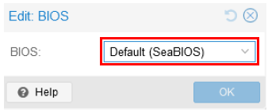

# Proxmox VE TIPS
Here are some tips for creating a Proxmox VE VM.
For more information on performance tweaks, please refer [here](https://pve.proxmox.com/wiki/Performance_Tweaks).

---

### [Sample Configurations and Miscellaneous for Mobile Network](https://github.com/s5uishida/sample_config_misc_for_mobile_network)

---

## Table of Contents

- [When starting MongoDB, an illegal instruction occurs and MongoDB crashes](#mongodb_crash)
- [While building srsRAN_Project, an error occurs due to missing F16C, FMA and BMI instructions](#srsran_build_crash)
- [An error occurs on VM in related to Secure Boot](#error_related_to_secure_boot)
- [Selecting the cache type for disk](#select_disk_cache_type)
- [Selecting the disk format type when creating a VM](#select_disk_format_type)

---

## When starting MongoDB, an illegal instruction occurs and MongoDB crashes

If an illegal instruction occurs and MongoDB crashes when starting MongoDB, refer to [this](https://github.com/RocketChat/Rocket.Chat/issues/33495) and select `host` as the Type in the `Edit: Processors` dialog to enable AVX instruction for CPU of VM.

</img>

## While building srsRAN_Project, an error occurs due to missing F16C, FMA and BMI instructions

If an error occur while building srsRAN Project due to missing F16C, FMA and BMI instructions, select `host` as the Type in the `Edit: Processors` dialog to enable these instructions for CPU of VM.

</img>

## An error occurs on VM in related to Secure Boot

If an error occurs on VM in related to Secure Boot, try selecting `SeaBIOS` in the `Edit: BIOS` dialog.

</img>

## Selecting the cache type for disk

For the cache type of disk, recommend `Write back` for HDD and `Write back (unsafe)` for SSD.
It is also recommended to turn on the `IO thread`.

**For HDD**

</img>

**For SSD**

Also turn on `SSD emulation`.

</img>

## Selecting the disk format type when creating a VM

When creating a VM, the disk format type `Raw disk image (raw)` is a little faster than `QEMU image format (qcow2)`.

</img>
